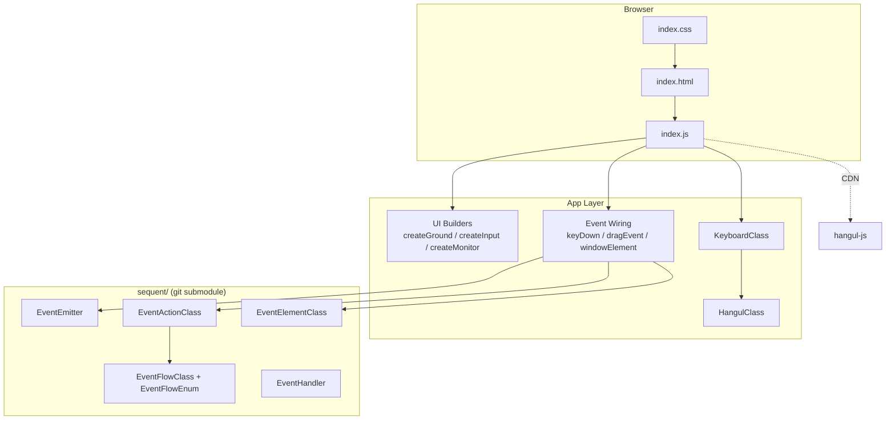
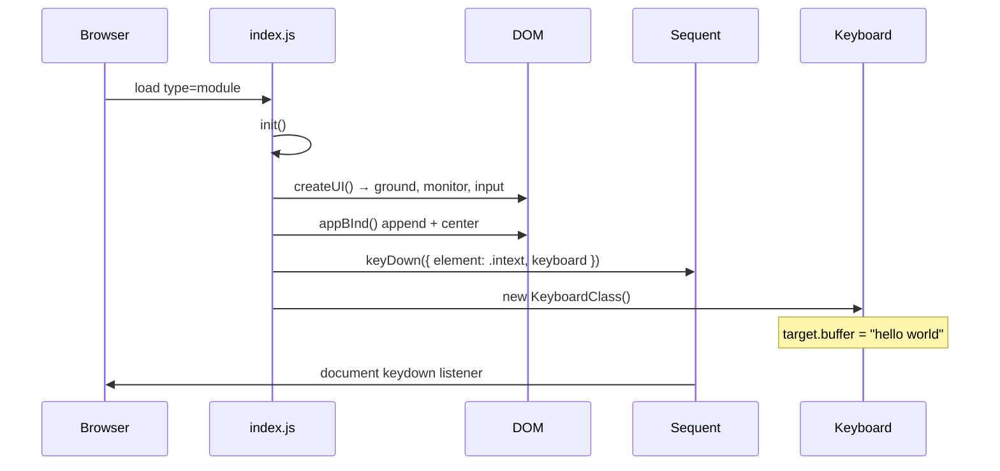
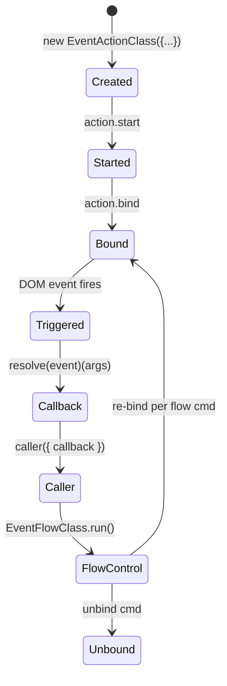

# Codebox — Architecture Reference

> Technical overview of the DOM event demo, sequent event framework integration, and Hangul typing subsystem.

## System Context



| Layer | Responsibility |
|-------|----------------|
| **Entry** | `index.html` loads ES modules; no inline markup — UI is created in JS |
| **Presentation** | `index.css` — window chrome, draggable panels, input area |
| **Application** | `index.js` — composes UI + binds sequent event flows |
| **Input** | `keyboardClass.js` + `hangulClass.js` — keystroke → buffer → display |
| **Framework** | `sequent/` — abstract DOM events into reusable action sequences |

---

## Repository Layout

```
codebox/
├── index.html          # Shell page (module entry)
├── index.css           # Layout & window chrome styles
├── index.js            # App entry: UI factory + event binding
├── hangulClass.js      # Dubeolsik keymap → jamo → syllable assembly
├── keyboardClass.js    # Language mode, buffers, target matching
├── sequent/            # Event framework (submodule → SequentClassBox)
│   ├── EventEmitter.js
│   ├── EventActionClass.js
│   ├── EventElementClass.js
│   ├── EventFlowClass.js
│   ├── EventFlowEnum.js
│   └── EventHandler.js
└── docs/
    ├── ARCHITECTURE.md       ← this file
    └── GUIDE_FOR_BEGINNERS.md
```

---

## Boot Sequence



On load, `init()` is the sole active entry point. The alternate `tast()` demo (fullscreen click handler) is present but commented out.

---

## UI Composition (`index.js`)

### Element Factory Pattern

All visible nodes are `<div>` elements created programmatically via `createDivElement()`. Each receives:

- CSS class `CenterElementClass` (absolute positioning baseline)
- Metadata bag `div.appends = {}` for future action hooks

| Factory | Output | Notes |
|---------|--------|-------|
| `createGround()` | 860×320 root panel | Wraps `windowElement()` — title bar, drag, close, max/min |
| `createMonitor()` | Upper content area | Placeholder panel (no logic wired yet) |
| `createInput()` | Lower input strip | Contains `<p class="intext">` — keyboard target |
| `windowElement()` | Draggable window shell | Composes bar + close + max/min controls |

### DOM Attachment

`appBInd(element, parent)` appends to DOM and auto-centers `HTMLDivElement` instances via `settingDivElement()` (parent-relative horizontal centering).

---

## Sequent Event Framework

### Design Intent

DOM listeners are decoupled from business logic through three primitives:

```
EventEmitter  →  wraps HTMLElement, multiplexes listeners per event tag
EventActionClass  →  single { tag, target, callback, caller } unit
EventElementClass  →  ordered list of actions with configurable flow mode
```

### EventEmitter

- **Singleton per element**: `EventEmitter.form(element)` uses `WeakMap` cache
- **Batch bind/unbind**: getter properties `bind`, `unbind`, `rebind`
- **Multiplexing**: multiple callbacks per tag stored in internal `Map`

### EventActionClass Lifecycle



Key fields:

| Field | Role |
|-------|------|
| `callback` | Receives `{ event, target, tag }`, returns flow command string |
| `caller` | Invoked by `trigger`; orchestrates when/how callback runs |
| `trigger` | Actual listener registered on `EventEmitter` |
| `bind` / `unbind` | Toggle listener on target emitter |

### EventElementClass Setup Modes

| Mode | Behavior | Used in index.js |
|------|----------|------------------|
| `setup.classic` | All actions share one caller; each binds independently | `keyDown`, `buttonDownEvent`, `reclosed` |
| `setup.chain` | Sequential: unbind current → bind next on non-loop return | — |
| `setup.call` | First action triggers batch bind of rest; flow via `EventFlowClass` | `dragEventElement` |
| `setup.flow` | Switch-based state machine over actions | — (partial impl) |

### EventFlowEnum / EventFlowClass

Flow commands are **bitmask-encoded**:

| Command | Purpose |
|---------|---------|
| `next` | Advance to next action in sequence |
| `loop` | Stay on current action (e.g. mousemove during drag) |
| `try` | Unbind all, re-bind first action (mouseup → reset drag) |
| `quit` / `break` | Tear down listeners |
| `unbind` / `null` | Listener lifecycle control |

`EventFlowClass.push(cmd, fn)` registers handlers; `setValue(cmd)` + `run()` executes matching callbacks and accumulates return flags.

---

## Event Flows in Application

### 1. Keyboard Input (`keyDown`)

```
document keydown
  └─ EventActionClass.callback
       ├─ Ctrl+S  → preventDefault (stub)
       ├─ Alt+N   → swap keyboard.lang / local lang
       ├─ Backspace → (empty handler)
       └─ printable key → keyboard.processKey(key)
                          → element.textContent = keyboard.getOutput()
```

Emitter target is `document` (global capture of keystrokes while focused).

### 2. Window Drag (`dragEventElement`)

Three-action `setup.call` chain:

| # | Tag | Target | Return | Effect |
|---|-----|--------|--------|--------|
| 0 | `mousedown` | bar element | `'next'` | Record offset, bind move/up |
| 1 | `mousemove` | document | `'loop'` | Update `left`/`top` styles |
| 2 | `mouseup` | document | `'try'` | Reset to mousedown-only state |

Maximize disables drag via `dragEvent.unbind`; restore re-binds `dragEvent.actions[0]`.

### 3. Window Chrome

- **Close**: `buttonDownEvent` → adds `element_close` class (`display: none`)
- **Max/Min**: toggles inner icon + calls `screenMaxElementEvent` which snapshots/restores inline styles (`width`, `height`, `left`, `top`)
- **Reopen**: `reclosed` listens on document click outside to remove `element_close`

---

## Input Subsystem

### HangulClass

Static initialization block defines:

- `keyMap` — Dubeolsik QWERTY → jamo
- `choMap`, `jungMap`, `jongMap` — jamo → Unicode composition indices

Composition formula (standard Hangul syllable block):

```
codePoint = 0xAC00 + (cho × 21 × 28) + (jung × 28) + jong
```

State machine: `cho` → `jung` → `jong` → flush & restart on next consonant.

> Note: `hangul-js` is loaded via CDN in `index.html` but **not currently imported** — assembly is hand-rolled in `assemble()`.

### KeyboardClass

Internal `Feld` helper manages string buffer + cursor index (`order`).

| Buffer | Purpose |
|--------|---------|
| `input` | Raw keystroke accumulation |
| `output` | Characters accepted as correct |
| `target` | Reference string (`"hello world"` by default) |

**English mode** (`lang === 'en'`): character-by-character match against `target`; on match, append to `output` and advance both orders.

**Korean mode** (`lang === 'ko'`): routes through `HangulClass.processKey()`; partial implementation — compares assembled jamo against target but full output path is incomplete.

Default language: `'en'`. Toggle via `Alt+N` in `keyDown`.

---

## External Dependencies

| Dependency | Source | Usage |
|------------|--------|-------|
| ES Modules | Native browser | All `.js` imports |
| `hangul-js` | unpkg CDN | Loaded but unused in current code |
| `sequent` | Git submodule | Local import from `./sequent/` |

Submodule remote: `https://github.com/armyUser3181/SequentClassBox`

---

## Runtime Requirements

- Modern browser with ES module support
- Serve via local HTTP server **or** open `index.html` directly (module imports require CORS-safe context; `file://` may fail depending on browser)

```bash
# example
npx serve .
# → open http://localhost:3000
```

---

## Work-in-Progress / Known Gaps

| Area | Status |
|------|--------|
| `main()`, `tast()` | Empty / commented alternate entry |
| Backspace in `keyDown` | Handler stub present, no logic |
| Korean mode output | Incomplete vs English mode |
| `hangul-js` CDN | Loaded, not wired |
| `monitor` panel | Created, no content binding |
| `KeyboardClass.processKey` ko branch | References `this.order` (undefined on class) |
| `EventElementClass.setup.flow` | References undefined `number` variable |
| `index.css` `.monitor` | Empty `background-color` value |

---

## Extension Points

1. **New event flows** — compose `EventActionClass` instances, pick `setup.*` mode, call `emitter.bind`
2. **Typing game logic** — extend `KeyboardClass.target.buffer`, add scoring in `processKey` match branch
3. **Monitor panel** — bind `keyboard.getOutput()` or diff view to `createMonitor()` element
4. **EventHandler** — centralize multiple `EventElementClass` groups when app grows beyond inline wiring

---

## Quick API Reference

### Sequent

```js
const emitter = EventEmitter.form(element);
const action = new EventActionClass({ callback, tag: 'click', target: emitter });
const group = new EventElement();
group.push(action);
group.setup.classic;  // wires caller + binds
emitter.bind;
```

### App Helpers

```js
createUI()                          // { input, monitor, ground }
keyDown({ element, keyboard })      // global keydown → typing
dragEventElement({ element, down, move, up })
screenMaxElementEvent({ element, target, action })
buttonDownEvent({ element, action })
```

### Input

```js
const kb = new KeyboardClass();
kb.lang = 'en' | 'ko';
kb.processKey('h');                 // mutates buffers
kb.getOutput();                     // current display string
```
